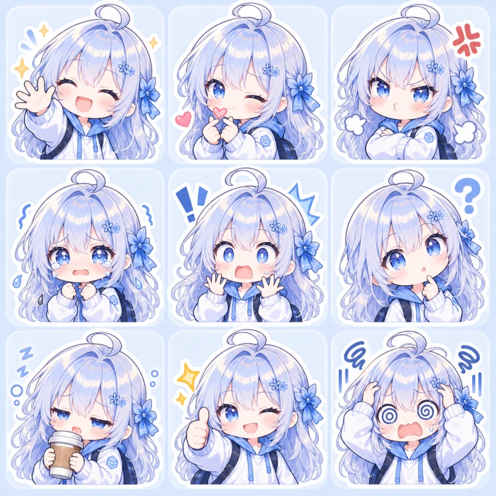
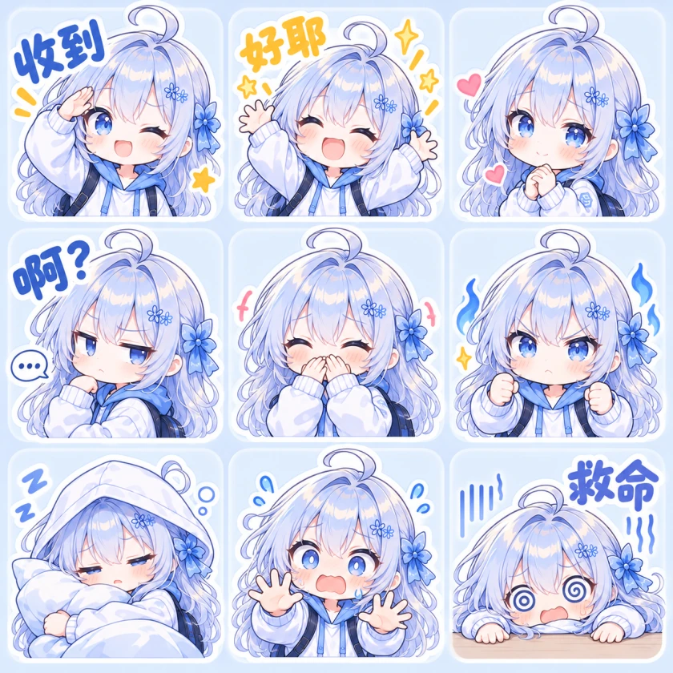
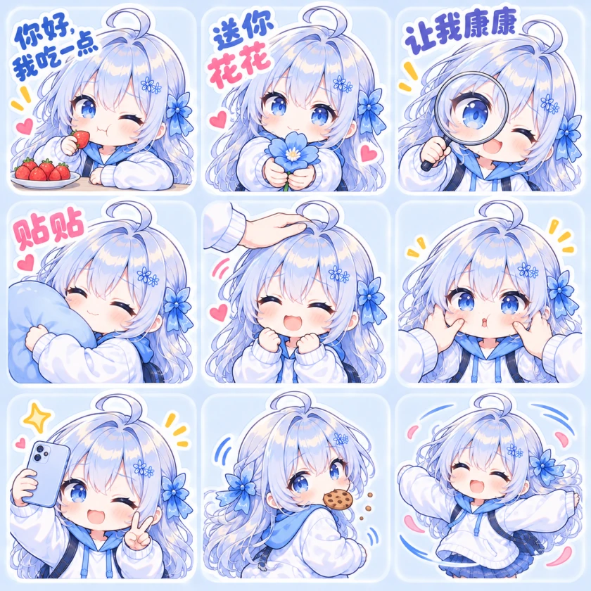
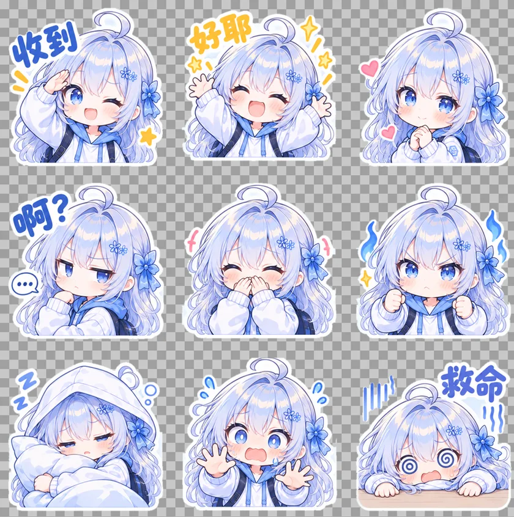
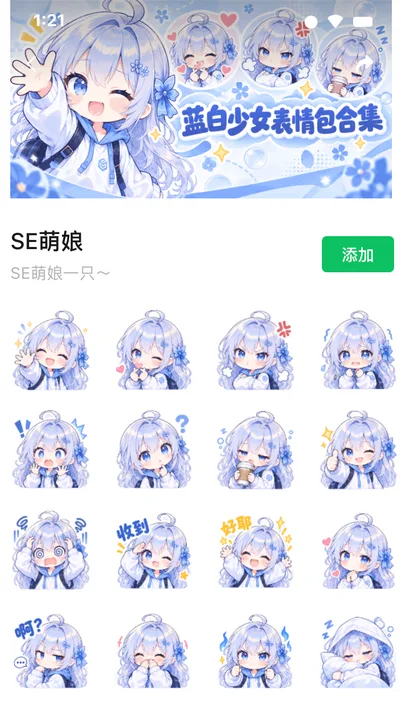

# 微信表情包工作坊 · wechat-sticker

一个把角色参考图制作成微信表情专辑素材的 Agent Skill。支持九宫格表情、少量中文梗图、宣传横幅和透明封面，并为不同生成类别提供独立 reference。

它把系列创作中的经验整理成可复用流程：角色一致性、续作梗与动作去重、中文检查，以及精确尺寸和真实透明度验收。

## 效果预览

以下是本 skill 整理流程所依据的实际生成案例，展示同一角色如何扩展成不同类型的素材。角色由使用者的参考图决定；最终画风和细节取决于所用图像生成工具。

### 九宫格表情

点击图片可查看大图。

| 纯表情 | 少量中文 | 可爱梗续作 |
| --- | --- | --- |
| [](assets/demos/sticker-grid-expressions.webp) | [](assets/demos/sticker-grid-captions.webp) | [](assets/demos/sticker-grid-cute-memes.webp) |
| 用动作表达情绪 | 四格短文字，其余无字 | 根据已有套组继续设计动作与文案 |

对应流程：[九宫格生成](references/sticker-grid.md) · [梗选择与续作去重](references/memes.md)。续作生成后仍需逐格核对文字和动作，不能仅凭提示词认定已去重。

### 表情合集宣传横幅

750×400 横幅示例，将主角色、表情预览和标题整合成一张宣传图。


对应流程：[宣传横幅](references/banner.md)。以上是便于 GitHub 加载的 WebP 展示图；实际交付仍按用户规格导出 PNG。图片来源与展示尺寸见 [demo 说明](assets/demos/README.md)。

### 拆片与去背景

九宫格是合集图，要当独立表情使用还需拆片并去掉卡片底色。左图是拆出的白底单片，右图是去背景后叠在棋盘格上的效果，透明区域清晰可见。


整套九张去背景后的联系表（棋盘格预览）：



对应流程：[拆片去背景与验收](references/cutout.md)。抠图由 `scripts/sticker_cutout.py` 按确定性规则完成，适用近似均匀的纯色卡片底；复杂背景仍需逐张人工验收。

### 上架效果

同一套素材（横幅、封面、透明单片）上传微信表情商店后的专辑页效果，截图由使用者提供。



## 能做什么

| 类别 | 默认输出 | reference |
| --- | --- | --- |
| 纯表情九宫格 | 3×3，一张图九个动作 | [sticker-grid.md](references/sticker-grid.md) |
| 少量中文九宫格 | 默认 3–4 格短文字，其余无字 | [sticker-grid.md](references/sticker-grid.md) |
| 梗图／系列续作 | 按已有文字、动作和场景记录去重 | [memes.md](references/memes.md) |
| 宣传横幅 | 750×400 PNG | [banner.md](references/banner.md) |
| 专辑封面 | 240×240 PNG、透明、无白描边 | [cover.md](references/cover.md) |
| 九宫格拆透明单片 | 九张去卡片底的透明 PNG + 棋盘格预览 | [cutout.md](references/cutout.md) |
| 导出与检查 | 像素尺寸、格式、Alpha、大小；可选单格裁切 | [export-and-qa.md](references/export-and-qa.md) |

尺寸是来自制作案例的可覆盖预设，不是微信官方完整规范。平台要求有更新时，以用户提供的当前提交页面为准。九宫格是合集图，不等于可以直接上传的九个独立表情文件。

## 安装到 Codex

下载仓库 ZIP 并解压，或克隆仓库。在仓库根目录执行以下命令，将整个目录复制成一个名为 `wechat-sticker` 的 skill：

```bash
skill_destination="${CODEX_HOME:-$HOME/.codex}/skills/wechat-sticker"
if [ -e "$skill_destination" ]; then
  printf '目标已存在，请先比较现有版本：%s\n' "$skill_destination"
else
  mkdir -p "$skill_destination"
  cp SKILL.md requirements.txt "$skill_destination/"
  cp -R agents references assets scripts "$skill_destination/"
fi
```

其他支持 `SKILL.md` 的宿主可按自己的技能加载方式使用本目录。可读规范不依赖 Python；运行附带图片处理脚本需 Python 3.9+ 和 Pillow：

```bash
python3 -m venv .venv
.venv/bin/python -m pip install -r requirements.txt
```

图像生成由宿主提供。仓库不内置 API key，不绑定付费服务，也不调用模型。附带脚本只进行本地检查、尺寸调整、裁切和确定性的卡片底去背景（`sticker_cutout.py`，适用近似均匀纯色底），不负责绘制角色，也不做任意场景的通用抠图。

## 调用示例

附上自己的角色图后，可以直接说：

> 使用 $wechat-sticker，基于这张角色图做 Q 版九宫格，三个格子带简短中文，其余无字。

> 使用 $wechat-sticker，再整一套可爱的梗，角色保持一致，不要与上一套的文字和动作重复。

> 使用 $wechat-sticker，给这个表情专辑做 750×400 宣传横幅，标题用“今天也要可可爱爱”。

> 使用 $wechat-sticker，做 240×240 透明封面，正面半身，无文字、无白色描边，检查是否超过 500KB。

续作时保留前一轮生成的 `character.md`、`sticker-history.json` 和图片。换会话时一并提供，才能可靠去重。

## 本地图片工具

```bash
# 只读检查，--profile cover 验证尺寸、PNG、实际透明像素和非空内容
.venv/bin/python scripts/image_assets.py check output/cover.png --profile cover

# 精确导出。输入必须已经有实际透明背景；不透明输入会失败，不会“伪造”透明。
.venv/bin/python scripts/image_assets.py export source/cover.png output/cover.png --profile cover

# 横幅默认等比裁切；也可选择等比适配并填充
.venv/bin/python scripts/image_assets.py export source/banner.png output/banner.png --profile banner --fit contain --background '#EAF3FF'

# 按 3×3 数学等分裁切；输入有不等间距时用 --boxes 指定实际边界
.venv/bin/python scripts/image_assets.py split-grid output/grid.png output/tiles

# 单片去卡片底：边缘泛洪抠图，输出透明 PNG 和棋盘格检查预览
.venv/bin/python scripts/sticker_cutout.py output/tiles/sticker-01.png output/cutout/sticker-01.png --preview output/preview/sticker-01.png

# 浅色道具贴边被误删时用保护框；白边缺口渗漏进头发时加大 --erode
.venv/bin/python scripts/sticker_cutout.py output/tiles/sticker-04.png output/cutout/sticker-04.png --protect 0,95,215,418 --erode 4
```

工具输出 JSON；验收不通过退出码为 1，参数或文件错误为 2。默认不覆盖已有文件。裁切不等于去背景；抠图适用近似均匀的纯色卡片底，仍须逐张看图验收。

## 仓库结构

```text
SKILL.md                     技能入口与按类别路由
agents/openai.yaml            Codex 展示信息
references/
  character-and-history.md   角色锚点与记录方法
  sticker-grid.md            纯表情／少量文字九宫格
  memes.md                   梗选择与续作去重
  banner.md                  750×400 宣传横幅
  cover.md                   240×240 透明封面
  cutout.md                  拆片去背景与验收
  export-and-qa.md            文件导出、命令与验收
assets/
  demos/                    README 效果预览图与说明
  sticker-history.template.json
scripts/image_assets.py      本地图片工具（检查、导出、裁切）
scripts/sticker_cutout.py    卡片底去背景工具
tests/                       两个脚本的行为测试
.github/workflows/check.yml  Python 测试与依赖安装
```

## 开发与发布

```bash
.venv/bin/python -m unittest discover -s tests -v
```

仓库包含中文说明、按类别提示词模板、通用记录模板、本地校验工具，以及经用户选用的生成效果展示图。不包含制作案例的原始角色图、私人文件路径或密钥。示例图集中存放在 `assets/demos/`；日常输入、生成结果和本机交接文件仍由 `.gitignore` 排除。

许可证为 [MIT](LICENSE)，适用于本仓库的代码、说明和模板；使用者输入或生成的图片不因使用本仓库而自动获得该许可证。这个项目不会替使用者上传或发布微信专辑。
